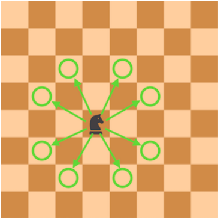

Bài toán di chuyển của quân mã (Knight) trong cờ vua

---

## Mô tả

Trong cờ vua, quân mã (knight) có thể di chuyển một lần đến một trong tám hướng được đánh dấu bằng hình tròn như hình dưới đây:



Tuy nhiên, quân mã không thể di chuyển ra ngoài bàn cờ.

```python
dr = [2, 1, -1, -2, -2, -1, 1, 2]
dc = [1, 2, 2, 1, -1, -2, -2, -1]
Bàn cờ
Vị trí của mỗi ô trên bàn cờ được biểu diễn như sau:


Ví dụ, nơi giao nhau giữa cột A và hàng 1 được gọi là A1.

Yêu cầu
Hãy hoàn thành hàm solution sao cho, với vị trí của quân mã pos được truyền vào dưới dạng tham số, trả về số ô mà quân mã có thể di chuyển đến sau một lần di chuyển.

Thông tin tham số
pos: vị trí của quân mã được truyền vào hàm solution dưới dạng một chuỗi gồm hai ký tự.

Chuỗi này bao gồm:

Một chữ cái in hoa từ A đến H.

Một chữ số từ 1 đến 8.

Không có trường hợp nào mà vị trí được truyền vào là sai.

Giá trị trả về
Trả về số ô mà quân mã có thể di chuyển đến sau một lần di chuyển.

Ví dụ
Nếu quân mã ở vị trí A7 thì như hình dưới đây, không thể di chuyển sang trái, và sang phải thì có thể di chuyển đến ba ô (trừ ô trên cùng).

⛳ Chiến lược giải bài:
Chuyển đổi vị trí ký tự (ví dụ: "A7") thành tọa độ hàng–cột số học để dễ tính toán:

Cột: "A" → 0, "B" → 1, ..., "H" → 7

Hàng: "1" → 0, "2" → 1, ..., "8" → 7

Xác định 8 bước di chuyển khả thi của quân mã bằng cách dùng 2 mảng dr, dc đại diện cho hướng:

python
Copy
Edit
dr = [2, 1, -1, -2, -2, -1, 1, 2]
dc = [1, 2, 2, 1, -1, -2, -2, -1]
→ Mỗi dr[i] và dc[i] tạo thành 1 hướng đi.

Duyệt từng hướng và kiểm tra xem vị trí mới có nằm trong bàn cờ không (tức 0 <= hàng mới < 8 và 0 <= cột mới < 8).

Đếm tổng số nước đi hợp lệ.

8x8

Giả sử quân mã ở "A7":

"A7" → (r=6, c=0)

Duyệt 8 hướng → chỉ có 3 hướng nằm trong bàn cờ

✅ Trả về 3