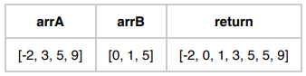

# 🧩 Bài toán: Gộp hai danh sách đã sắp xếp

---

## 📄 Mô tả

Bạn muốn gộp hai danh sách `arrA` và `arrB` **đã được sắp xếp theo thứ tự tăng dần** thành một danh sách duy nhất.  
Danh sách sau khi gộp **cũng phải được sắp xếp theo thứ tự tăng dần**.

### 🧾 Ví dụ:
Nếu:
```python
arrA = [-2, 3, 5, 9]
arrB = [0, 1, 5]
Sau khi gộp và sắp xếp tăng dần, ta được:

python
Copy
Edit
[-2, 0, 1, 3, 5, 5, 9]
📌 Yêu cầu
Hoàn thành hàm solution sao cho:

Khi hai danh sách arrA, arrB đã được sắp xếp tăng dần được truyền vào,

Hàm trả về một danh sách duy nhất, đã được sắp xếp tăng dần sau khi gộp hai danh sách đó.

Bạn cần điền vào phần trống để hoàn thành toàn bộ đoạn mã.

🧷 Mô tả tham số
arrA: danh sách số nguyên đã được sắp xếp tăng dần.

arrB: danh sách số nguyên đã được sắp xếp tăng dần.

1 ≤ len(arrA), len(arrB) ≤ 200,000

Mỗi phần tử là một số nguyên từ -1,000,000 đến 1,000,000.

🔁 Giá trị trả về
Trả về một danh sách duy nhất đã được sắp xếp tăng dần sau khi gộp arrA và arrB.

✅ Ví dụ đầu vào / đầu ra
python
Copy
Edit
Input:
arrA = [-2, 3, 5, 9]
arrB = [0, 1, 5]

Output:
[-2, 0, 1, 3, 5, 5, 9]
r
Copy
Edit
